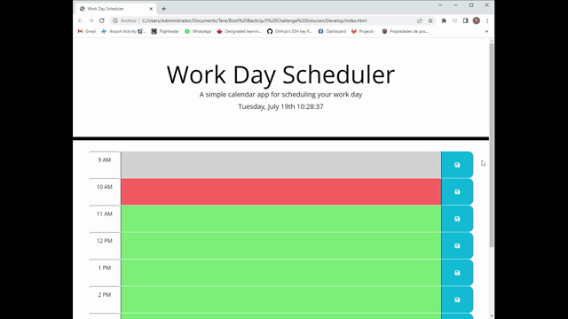

# Work Day Scheduler.

 Practice of Third-Party APIs. Based on a starter code, we create a simple calendar application.

 ## Application functionality.

 * The calendar presents hours from 9am to 5pm and is colored depending on the current time:
    * Gray - Time already past
    * Red - Actual time
    * Green - Time to come
  
  * It allows the user to save events for each hour.

  * The user can change/update the event he saved before.

  * The user's inputs are save on local storage.

 ## Mock up

  

  ## The work.

  * DOM access and manipulation using jQuery

  * Display of current date and time(live)

  * Use of local storage and JSON

  * Practice of delegation (when we delegate an event listener to the parent)

  * Use of Bootstrap to style

  ## Techs

  * Html

  * CSS

  * Javascript

  * jQuery

  * Bootstrap

  * Google Fonts

  * Moment.js

  ## Link to the application

  * [Try the calendar here!](https://)

